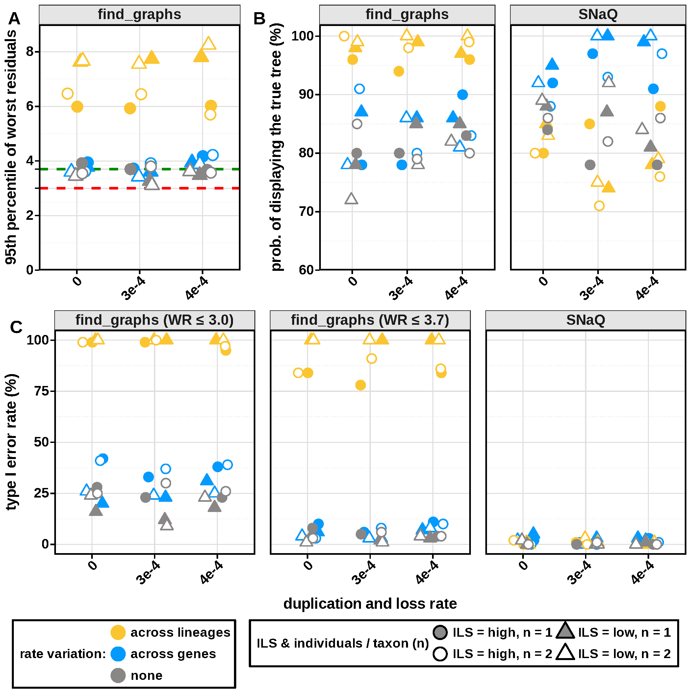

# Simulation for hidden paralogy and rate variation 

We simulate phylogenomic datasets to test whether model violations — gene duplication/loss (hidden paralogy) and substitution rate variation — can cause network inference methods (find_graphs, SNaQ) to detect spurious hybridization when the true history is a tree. Parameters are calibrated from real reptile UCE data ([Crawford et al. 2012](https://academic.oup.com/sysbio/article/61/5/717/1735316)).

Ready to dive deep? Let's go! 

## Pipeline

| Step | Script | What it does |
|---|---|---|
| 1. Simulation | `simulation.jl` | SimPhy → filter paralogs → Seq-Gen → IQ-TREE → ASTRAL-IV |
| 2. SNaQ | `snaq.jl` | Network inference at h=0 and h=1 |
| 3. find\_graphs | `findgraphs.jl` | Admixture graph inference via f-statistics |
| 4. Post-processing | `run_postprocessing.jl` | Aggregate results across all parameter sets |
| 5. Summary | `summary_*.jl` | Compute statistics and generate plots |
| 6. Visualization | `visualization_scripts/` | Quarto notebooks for paper figures |

Details on each script - Check this out [scripts/readme.md](scripts/readme.md).

## Reproducing the Analysis

All commands run from the **repo root**. Steps 2–3 are independent and can run in parallel after Step 1.

**0. Install dependencies**

Binary and R executables go in `executables/`. See [software_installation.sh](executables/software_installation.sh). Julia packages are listed in `Project.toml` and `Manifest.toml`. 

```bash
bash executables/software_installation.sh   # external binaries
julia -e 'using Pkg; Pkg.instantiate()'     # Julia packages
```

**1. Run simulation** (one parameter set, 100 replicates, multiple processors)

The species tree branch lengths and substitution rates were derived from empirical reptile data in [scripts/speciestree.jl](scripts/speciestree.jl).

```bash
julia -p 100 scripts/simulation.jl \
    --dup_rate 0.0003 --loss_rate 0.0003 \
    --ratevar G --n_reps 100 --n_inds 1 --SF 1.0
```

`simulation.jl` runs four steps per replicate: (1) simulate gene trees, (2) simulate sequences, (3) estimate gene trees, (4) estimate the species tree. The workflow is shown below.


## Key parameters used in our simulation

Variable parameters:

| Parameter | Values | Notes |
|---|---|---|
| `--ratevar` | `N`, `G`, `L` | None, gene-specific, lineage-specific |
| `--dup_rate` / `--loss_rate` | `0.0`, `0.0003`, `0.0004` | Per-gene-per-generation; `0.0` disables duplication/loss |
| `--SF` | `0.5`, `1.0` | Ne scaling factor; higher = higher ILS |
| `--n_inds` | `1`, `2` | Individuals sampled per species |

Other parameters:

| Parameter | Values | Notes |
|---|---|---|
| `--n_reps` | any int | number of replicates; we used 100 |
| `--n_genes` | any int | number of genes; we used 1000 |
| `--gene_len` | any int | bp length per gene; we used 1000 |

*Note*
1. Legacy functions/arguments exist in `simulation.jl`, `snaq.jl`, and `findgraphs.jl`; the parameters above define our 36 main simulation settings.
2. `--n_reps`, `--n_genes`, and `--gene_len` are consistent across all settings.
3. Output folders are named `DUP<d>-LOS<l>-RV<r>-N_ind<n>-SF<s>-genelen<g>`.
4. Using `-p N` where N matches the number of replicates gives the best efficiency.

**2. Network inference**

```bash
# SNaQ
julia -p 100 scripts/snaq.jl \
    --dup_rate 0.0003 --loss_rate 0.0003 --ratevar G --n_reps 100 --n_inds 1 --runs 100

# find_graphs
julia -p 100 scripts/findgraphs.jl \
    --dup_rate 0.0003 --loss_rate 0.0003 --ratevar G --n_reps 100 --n_inds 1 --runs 100 --block 1000
```

`--runs` controls optimization runs per model: at `--runs 100`, SNaQ uses 10 runs under H=0 (hard-coded) and 100 under H=1; find_graphs uses 100 for both. `--block` (find_graphs only) sets the number of SNP blocks; we used 1000.

**3. Post-process all parameter sets at once**

```bash
julia -p 10 scripts/run_postprocessing.jl --mode simulation
julia -p 10 scripts/run_postprocessing.jl --mode snaq
julia -p 10 scripts/run_postprocessing.jl --mode findgraphs
```

Or you can postprocess the results from simulation, snaq and find_graphs individually. 
For example: 

```bash
julia -p 100 scripts/snaq_postprocess.jl --dup_rate 0 --loss_rate 0 --ratevar N --n_inds 2 --SF 1 --n_reps 100
```


**4. Summarize and visualize**

```bash
julia scripts/summary_simulation.jl
julia scripts/summary_snaq.jl
julia scripts/summary_findgraph.jl
quarto render visualization_scripts/visual_combined.qmd  # and any other visualization file
```

Visualization scripts were saved in [visualization_scripts](visualization_scripts/) and check that readme for specific details[visualization_scripts/readme.md](visualization_scripts/readme.md). 

## Major Results



**(A)** Under constant or gene-specific rate variation, the 95th percentile of the worst residuals (WR) from fitting the true species tree exceeded the standard threshold of 3.0, so we also evaluated a more permissive WR ≤ 3.7 threshold. Under lineage-specific rates, WR reached 6–8, making model selection unreliable at any common threshold. **(B)** Both find\_graphs and SNaQ recovered the true species tree topology in ~87% of replicates under h=1. **(C)** Hidden paralogy had little effect on type I error for either method, but lineage-specific rate variation drove false reticulation detection to near 100% in find\_graphs even under WR ≤ 3.7, while SNaQ remained conservative throughout.

In short: lineage-specific rate variation, not hidden paralogy, is the main driver of spurious reticulation signal. The standard WR threshold in find\_graphs is too strict under the realistic conditions we examined here, and even the permissive threshold breaks down under lineage-specific rates.

## Dependencies

Check [Executables README](executables/readme.md) for details! 

**Julia** (see `Project.toml`): `PhyloNetworks`, `QuartetNetworkGoodnessFit`, `PhyloPlots`, `RCall`, `CSV`, `DataFrames`, `ArgParse`, `Distributed`.

**External binaries** (symlinked in `executables/`): SimPhy, Seq-Gen, IQ-TREE 2, astral, snp-sites.

**R**: `admixtools`, `optparse`, `dplyr`, `igraph` — required for find_graphs and visualization.

## Repository Layout

After running all simulation, the folder structure should be similar to this: 

```
simulation-reptiles/
├── scripts/                        Pipeline scripts (see scripts/readme.md)
│   ├── utilities.jl                Shared Julia helpers across all stages
│   ├── simulation.jl               Entry point: SimPhy + seq-gen + IQ-TREE
│   ├── simulation_postprocess.jl   Aggregate per-replicate simulation stats
│   ├── snaq.jl                     Entry point: SNaQ runs (parallel)
│   ├── snaq_1rep.jl                Per-replicate SNaQ worker
│   ├── snaq_postprocess.jl         Aggregate per-replicate SNaQ results
│   ├── findgraphs.jl               Entry point: find_graphs runs (parallel)
│   ├── findgraphs_1rep.R           Per-replicate find_graphs worker (R)
│   ├── findgraphs_postprocess.jl   Aggregate per-replicate find_graphs results
│   ├── summary_simulation.jl       Cross-setting simulation summary CSV
│   ├── summary_snaq.jl             Cross-setting SNaQ summary CSV
│   ├── summary_findgraph.jl        Cross-setting find_graphs summary CSV
│   ├── visual_utilities.R          Shared R plotting helpers
│   ├── speciestree.jl              One-time: true species tree construction
│   ├── clean.jl                    Remove intermediate output files
│   └── readme.md                   Script-level documentation
│
├── visualization_scripts/          Quarto visualization notebooks
│   ├── visualization_simulation.qmd
│   ├── visualization_snaq.qmd
│   ├── visualization_finsgraphs.qmd
│   ├── visualize_baselinetree.qmd
│   └── visual_combined.qmd
│
├── executables/                    Symlinks to required binaries
│   ├── simphy -> ...
│   ├── iqtree2 -> ...
│   ├── seq-gen -> ...
│   ├── astral -> ...
│   └── snp-sites -> ...
│
├── simphy-configs/                 SimPhy configuration templates
│   ├── Example.conf
│   ├── simphysim-conf
│   └── simphysim-conf-master
│
├── output/               Per-replicate outputs (not tracked by Git)
│   │
|   |   # 36 parameter settings in total 
│   │   # 12 DUP/LOSS=0.0 settings 
│   ├── DUP0.0-LOS0.0-RVN-N_ind1-SF0.5-genelen1000/
│   ├── ... 
│   ├── DUP0.0-LOS0.0-RVL-N_ind1-SF0.5-genelen1000/
│   │
│   │   # 12 DUP/LOSS=0.0003 settings 
│   ├── DUP0.0003-LOS0.0003-RVN-N_ind1-SF0.5-genelen1000/
│   ├── ...
│   ├── DUP0.0003-LOS0.0003-RVL-N_ind2-SF1.0-genelen1000/
│   │
│   │   # 12 DUP/LOSS=0.0004 settings 
│   ├── DUP0.0004-LOS0.0004-RVN-N_ind1-SF0.5-genelen1000/
│   ├── ...
│   └── DUP0.0004-LOS0.0004-RVG-N_ind2-SF1.0-genelen1000/
│
│       # Each parameter folder shares this structure:
|       # A brief overview of the output folder, but it contains more intermediate files 
│       ├── arguments-<paramname>.log       command-line arguments used
│       ├── simulation_<paramname>.csv      aggregated simulation results
│       ├── random_seed_[software].txt   per-software seeds
│       ├── screen_<paramname>.log          main worker log
│       ├── screen_<paramname>_worker*.log  per-worker logs
│       ├── rep001/
│       │   ├── genetrees_simphy/           raw SimPhy gene trees
│       │   ├── genetrees_singlecopy/       filtered single-copy gene trees
│       │   │   ├── besttrees.tre
│       │   │   ├── gene.treefile
│       │   │   └── mapping.csv
│       │   ├── seqgenfolder/               Seq-Gen sequence output
│       │   ├── iqtreefolder/               IQ-TREE output
│       │   ├── astralfolder/               ASTRAL species tree
│       │   │   ├── astral.tre
│       │   │   └── astral_mapping.txt
│       │   ├── snaqfolder/
│       │   │   ├── CF_results.csv
│       │   │   ├── id_to_species.csv
│       │   │   ├── snaq_gof_results_H0.csv
│       │   │   ├── H0_output/              SNaQ H=0 run outputs
│       │   │   └── H1_output/              SNaQ H=1 run outputs
│       │   └── findgraph/
│       │       ├── rep01.vcf
│       │       ├── eigenstrat_rep01.geno
│       │       ├── eigenstrat_rep01.ind
│       │       ├── eigenstrat_rep01.snp
│       │       ├── rep01_admix0_summary_table.txt
│       │       ├── rep01_admix0_unique_graphs.rds
│       │       ├── rep01_admix1_summary_table.txt
│       │       ├── rep01_admix1_unique_graphs.rds
│       │       └── rep01_f2.rds
│       ├── rep002/
|       ├── ... 
|       ├── # Feel free to add more replicates but in our simulation we used 100 
│       └── rep100/ 
│
├── simulation_summary/             Per-setting simulation summary CSVs
│   └── summary_<paramname>.csv
│
├── snaq_summary/                   Per-setting SNaQ summary CSVs
│   └── SNaQ-<paramname>-summary.csv
│
├── findgraph_summary/              Per-setting find_graphs summary CSVs
│   └── findgraph-<paramname>.csv
│
├── results/                        Cross-setting aggregated summary CSVs
│   ├── SNaQ_summary.csv
│   ├── findgraph_summary.csv
│   ├── summary_concatenated.csv
│   └── combined_*.csv
│
├── visualization_results/          Generated figures (not tracked by Git)
│   ├── simulation/
│   ├── snaq/
│   └── findgraph/
│
├── plots/                          Figures and workflow diagrams
├── notebook/                       Analysis notebooks and documentation
├── executables/                    Executables saved here 
├── example/                        Exploratory analyses and debugging
├── third_party_scripts/            External scripts (Apache 2.0)
├── Project.toml                    Julia package environment
├── Manifest.toml
└── readme.md
```

## License

MIT License. `third_party_scripts/vcf2eigenstrat.py` is Apache 2.0 (see `third_party_scripts/LICENSE-APACHE-2.0.txt`).
