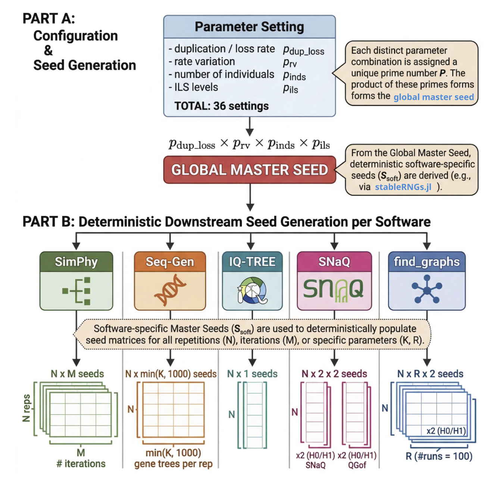

# Scripts

This directory contains the pipeline for the reptile phylogenomics simulation. 

---

## Scripts at a glance

| Script | Language | Purpose |
|---|---|---|
| `speciestree.jl` | Julia | One-time: build species tree from empirical data |
| `simulation.jl` | Julia | Major simulation pipeline from gene tree simulation to species tree estimation|
| `simulation_postprocess.jl` | Julia | Postprocess and calculate RF distances for outputs from the `simulation.jl` |
| `snaq.jl` / `snaq_1rep.jl` | Julia | SNaQ inference (parallel + per-replicate) |
| `snaq_postprocess.jl` | Julia | Aggregate SNaQ results |
| `findgraphs.jl` / `findgraphs_1rep.R` | Julia/R | find_graphs inference (parallel + per-replicate) |
| `findgraphs_postprocess.jl` | Julia | Aggregate find_graphs results |
| `run_postprocessing.jl` | Julia | Batch launcher for all post-processing modes |
| `summary_simulation.jl` | Julia | Concatenate and summarize simulation CSVs |
| `summary_snaq.jl` | Julia | Summarize SNaQ results across parameter sets |
| `summary_findgraph.jl` | Julia | Summarize find_graphs results + plots |
| `utilities.jl` | Julia | Shared helpers: seed generation, tip manipulation |
| `seq-gen.sh` | Bash | Wrap Seq-Gen calls per gene, called in  `simulation.jl` |
| `concatenate_seq.py` | Python | Concatenate per-gene NEXUS alignments into FASTA, called in `simulation.jl` |
| `iqtree.pl` | Perl | Batch IQ-TREE across genes; collect best trees, called in `simulation.jl` |
| `visual_utilities.R` | R | Shared plotting helpers (used by summary scripts), called in postprocessing and visualization scripts |
| `clean.jl` | Julia | Remove the `output/` directory |
| `rerun_gof.jl` | Julia | Re-run goodness-of-fit for specific replicates for sanity check |


---
After setting up following [main readme](../readme.md), let's check our major pipeline: 

## Pipeline

```
[0] SPECIES TREE      speciestree.jl  (one-time setup)

[1] SIMULATION        simulation.jl
      └─ SimPhy → paralogy filter → Seq-Gen → IQ-TREE → ASTRAL-IV

[2] SNAQ              snaq.jl  +  snaq_1rep.jl
      └─ SNaQ at h=0 and h=1 on estimated gene trees

[3] FIND_GRAPHS       findgraphs.jl  +  findgraphs_1rep.R
      └─ find_graphs / qpgraph on concatenated SNPs (admixtools)

[4] POST-PROCESSING   *_postprocess.jl  (or batch via run_postprocessing.jl)
      └─ summary statistics like RF distances, worst residuals, gamma summaries, etc per parameter set

[5] SUMMARY           summary_simulation.jl / summary_snaq.jl / summary_findgraph.jl
      └─ aggregate CSVs across parameter sets, compute statistics, generate plots

[6] VISUALIZATION     visualization_scripts/
      └─ Quarto notebooks producing heatmaps, boxplots, summary tables
```

Run all commands from the **repo root**. Steps 2–3 (SNaQ and find_graphs) are independent and can run in parallel after Step 1.

**Step 0 — species tree setup** *(one-time, interactive)*

Loads the Crawford reptile phylogeny, calibrates branch lengths in coalescent units, and writes the SimPhy-formatted species tree. 

---

**Step 1 — simulation**

```bash
julia -p 100 scripts/simulation.jl \
    --dup_rate 0.0003 --loss_rate 0.0003 \
    --ratevar G --n_reps 100 --n_genes 1000 \
    --n_inds 1 --SF 1.0 --gene_len 1000
```

For each replicate: SimPhy generates gene trees → filter to single-copy → Seq-Gen simulates sequences → IQ-TREE estimates gene trees → ASTRAL infers the species tree. Outputs go to `output/<paramname>/rep*/`.

We recommend to have number of processors `-p` match with the `--n_reps` to increase parallelization efficiency. 

---

**Step 2 — simulation post-processing**

```bash
julia -p 10 scripts/simulation_postprocess.jl \
    --dup_rate 0.0003 --loss_rate 0.0003 \
    --ratevar G --n_reps 100 --n_inds 1
```

Computes RF distances between the true species tree and ASTRAL estimates. Writes `summary_<paramname>.csv` to the parameter folder.

---

**Step 3 — SNaQ**

```bash
julia -p 100 scripts/snaq.jl \
    --dup_rate 0.0003 --loss_rate 0.0003 \
    --ratevar G --n_reps 100 --runs 100 --n_inds 1
```

Runs SNaQ at h=0 and h=1 per replicate (via `snaq_1rep.jl`). Optional: use `--rep_start`/`--rep_end` to resume a partial run: 

```bash
julia -p 100 scripts/snaq.jl \
    --dup_rate 0.0003 --loss_rate 0.0003 \
    --ratevar G --n_reps 100 --runs 100 --n_inds 1 \
    --rep_start 51 --rep_end 100 
``` 
The above will only run rep 51 to 100. Seeds are pre-determine so results are deterministic no matter which replicate runs first.  

---

**Step 4 — SNaQ post-processing**

```bash
julia scripts/snaq_postprocess.jl \
    --dup_rate 0.0003 --loss_rate 0.0003 \
    --ratevar G --n_reps 100 --n_inds 1
```

Aggregates per-replicate SNaQ results into `SNaQ-<paramname>-summary.csv`.

---

**Step 5 — find\_graphs**

```bash
julia -p 100 scripts/findgraphs.jl \
    --dup_rate 0.0003 --loss_rate 0.0003 \
    --ratevar G --n_reps 100 --runs 100 \
    --block 100 --n_inds 1
```

Calls snp-sites on `concatenated.fasta`, converts to eigenstrat, then runs `find_graphs()` and `qpgraph()` from `admixtools` per replicate (via `findgraphs_1rep.R`). It can also take `--rep_start`
and `--rep_end` as SNaQ. `--block` is consistent with 1000 across our simulation (see our paper). 

---

**Step 6 — find\_graphs post-processing**

```bash
julia scripts/findgraphs_postprocess.jl \
    --dup_rate 0.0003 --loss_rate 0.0003 \
    --ratevar G --n_reps 100 --n_inds 1 \
    --new_WR_threshold 3.7
```

Adds RF distances, calculates summary statistics and applies worst-residual model selection (h=0 vs h=1) at the specified WR threshold, and writes `findgraph-<paramname>-summary.csv`.

---

## Batch post-processing: `run_postprocessing.jl`

After generating output for all parameter sets, use `run_postprocessing.jl` to run the appropriate post-processing script across every parameter folder in `output/` at once.

```bash
julia scripts/run_postprocessing.jl --mode simulation
julia scripts/run_postprocessing.jl --mode snaq
julia scripts/run_postprocessing.jl --mode findgraphs
```

This scans `output/` for folders matching the `DUP*-LOS*-RV*-N_ind*-SF*-genelen*` naming pattern, calls `<mode>_postprocess.jl` for each, copies the resulting summary CSV to `<mode>_summary/`, and (for snaq and findgraphs) collects consensus network PDFs into a central directory. Use `--n_reps`, `--output_dir`, or `--saved_path` to override defaults.

---

## Summary scripts: `summary_simulation.jl`, `summary_snaq.jl`, `summary_findgraph.jl`

After post-processing, these scripts concatenate and summarize results across all parameter sets.

```bash
julia scripts/summary_simulation.jl
julia scripts/summary_snaq.jl
julia scripts/summary_findgraph.jl
```

Each script reads the per-parameter CSVs from `<mode>_summary/`, computes aggregate statistics (e.g. type I error rates, topology recovery rates, gamma distributions), writes a combined CSV to `results/`, and generates diagnostic plots via R. `summary_findgraph.jl` also produces a taxon-level recovery table and worst-residual percentile summaries.

-- 

## Reproducibility 

All seeds are derived deterministically from parameter values, so every run is reproducible — see [seed control diagram](../plots/seed_control.png) below.



For an brief overview of the study and major results, see the [main readme](../readme.md).

