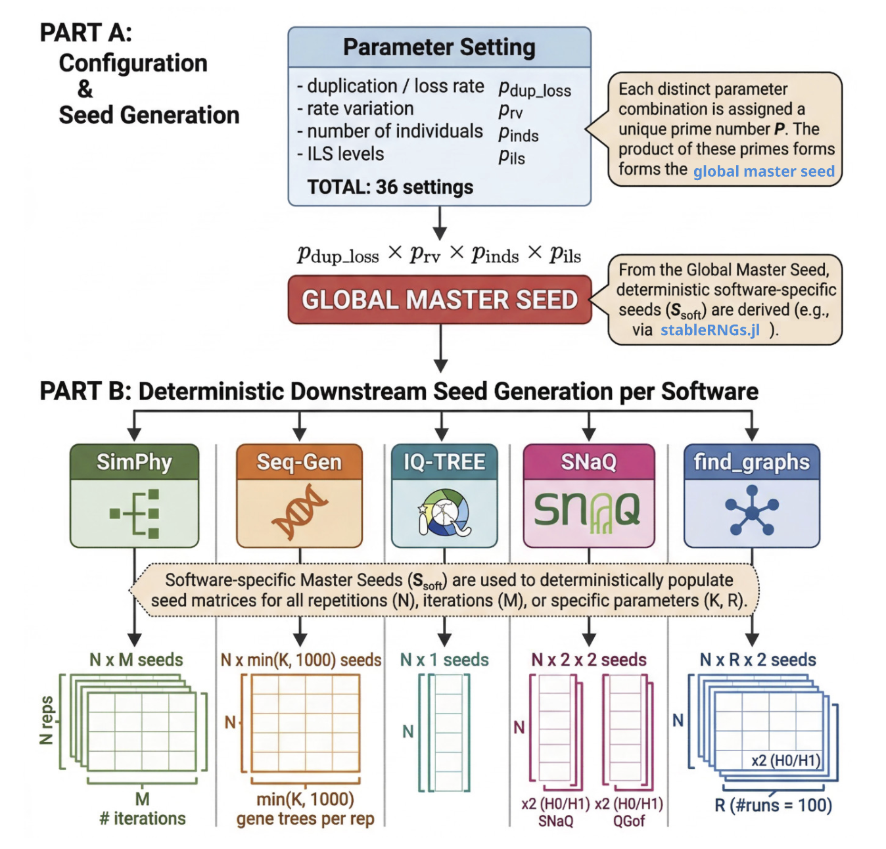

# Scripts

This directory contains the pipeline for the reptile phylogenomics simulation. 

---

## Scripts at a glance

| Script | Language | Purpose |
|---|---|---|
| `speciestree.jl` | Julia | One-time: build species tree from empirical data |
| `speciestree_basal_angio.jl` | Julia | One-time: second species tree from basal angiosperms (Angiosperms353 data from the Kew Tree of Life); helpers in `angiosperm/` |
| `speciestree_reptile.jl` | Julia | One-time: build species tree from empirical data |
| `simulation.jl` | Julia | Major simulation pipeline from gene tree simulation to species tree estimation|
| `simulation_postprocess.jl` | Julia | Postprocess and calculate RF distances for outputs from the `simulation.jl` |
| `snaq.jl` / `snaq_1rep.jl` | Julia | SNaQ inference (parallel + per-replicate) |
| `snaq_postprocess.jl` | Julia | Aggregate SNaQ results |
| `findgraphs.jl` / `findgraphs_1rep.R` | Julia/R | find_graphs inference (parallel + per-replicate) |
| `findgraphs_postprocess.jl` | Julia | Aggregate find_graphs results |
| `phynest.jl` / `phynest_1rep.jl` | Julia | PhyNEST inference (parallel + per-replicate) |
| `phynest_postprocess.jl` | Julia | Aggregate PhyNEST results |
| `run_postprocessing.jl` | Julia | Batch launcher for all post-processing modes |
| `summary_simulation.jl` | Julia | Concatenate and summarize simulation CSVs |
| `summary_snaq.jl` | Julia | Summarize SNaQ results across parameter sets |
| `summary_findgraph.jl` | Julia | Summarize find_graphs results + plots |
| `summary_phynest.jl` | Julia | Summarize PhyNEST results, calibrate the T* threshold + plots |
| `genetree_discordance_2inds.jl` | Julia | Per-combination discordance of two-individual gene trees on the 8-taxon scale (Table B1) |
| `utilities.jl` | Julia | Shared helpers: seed generation, tip manipulation |
| `seq-gen.sh` | Bash | Wrap Seq-Gen calls per gene, called in  `simulation.jl` |
| `concatenate_seq.py` | Python | Concatenate per-gene NEXUS alignments into FASTA, called in `simulation.jl` |
| `iqtree.pl` | Perl | Batch IQ-TREE across genes; collect best trees, called in `simulation.jl` |
| `visual_utilities.R` | R | Shared plotting helpers (used by summary scripts), called in postprocessing and visualization scripts |
| `clean.jl` | Julia | Remove the `output/` directory |
| `rerun_gof.jl` | Julia | Re-run goodness-of-fit for specific replicates for sanity check |


---
After setting up following [main readme](../readme.md), let's check our major pipeline: 

## Pipeline

```
[0] SPECIES TREE      speciestree_reptile.jl  (one-time setup)

[1] SIMULATION        simulation.jl
      └─ SimPhy → paralogy filter → Seq-Gen → IQ-TREE → ASTRAL-IV

[2] SNAQ              snaq.jl  +  snaq_1rep.jl
      └─ SNaQ at h=0 and h=1 on estimated gene trees

[3] FIND_GRAPHS       findgraphs.jl  +  findgraphs_1rep.R
      └─ find_graphs / qpgraph on concatenated SNPs (admixtools)

[4] PHYNEST           phynest.jl  +  phynest_1rep.jl
      └─ PhyNEST at h=0 and h=1 on the concatenated alignment

[5] POST-PROCESSING   *_postprocess.jl  (or batch via run_postprocessing.jl)
      └─ summary statistics like RF distances, worst residuals, gamma summaries, etc per parameter set

[6] SUMMARY           summary_simulation.jl / summary_snaq.jl / summary_findgraph.jl / summary_phynest.jl
      └─ aggregate CSVs across parameter sets, compute statistics, generate plots

[7] VISUALIZATION     visualization_scripts/
      └─ Quarto notebooks producing heatmaps, boxplots, summary tables
```

Run all commands from the **repo root**. Steps 2–4 (SNaQ, find_graphs and PhyNEST) are independent and can run in parallel after Step 1.

**Step 0 — species tree setup** *(one-time, interactive)*

Loads the Crawford reptile phylogeny, calibrates branch lengths in coalescent units, and writes the SimPhy-formatted species tree. 

---

**Step 1 — simulation**

```bash
julia -p 100 scripts/simulation.jl \
    --dup_rate 0.0003 --loss_rate 0.0003 \
    --ratevar G --n_reps 100 --n_genes 1000 \
    --n_inds 1 --SF 1.0 --gene_len 1000
```

For each replicate: SimPhy generates gene trees → filter to single-copy → Seq-Gen simulates sequences → IQ-TREE estimates gene trees → ASTRAL infers the species tree. Outputs go to `output/<paramname>/rep*/`.

We recommend to have number of processors `-p` match with the `--n_reps` to increase parallelization efficiency. 

---

**Step 2 — simulation post-processing**

```bash
julia -p 10 scripts/simulation_postprocess.jl \
    --dup_rate 0.0003 --loss_rate 0.0003 \
    --ratevar G --n_reps 100 --n_inds 1
```

Computes RF distances between the true species tree and ASTRAL estimates. Writes `summary_<paramname>.csv` to the parameter folder.

---

**Step 3 — SNaQ**

```bash
julia -p 100 scripts/snaq.jl \
    --dup_rate 0.0003 --loss_rate 0.0003 \
    --ratevar G --n_reps 100 --runs 100 --n_inds 1
```

Runs SNaQ at h=0 and h=1 per replicate (via `snaq_1rep.jl`). Optional: use `--rep_start`/`--rep_end` to resume a partial run: 

```bash
julia -p 100 scripts/snaq.jl \
    --dup_rate 0.0003 --loss_rate 0.0003 \
    --ratevar G --n_reps 100 --runs 100 --n_inds 1 \
    --rep_start 51 --rep_end 100 
``` 
The above will only run rep 51 to 100. Seeds are pre-determine so results are deterministic no matter which replicate runs first.  

---

**Step 4 — SNaQ post-processing**

```bash
julia scripts/snaq_postprocess.jl \
    --dup_rate 0.0003 --loss_rate 0.0003 \
    --ratevar G --n_reps 100 --n_inds 1
```

Aggregates per-replicate SNaQ results into `SNaQ-<paramname>-summary.csv`.

---

**Step 5 — find\_graphs**

```bash
julia -p 100 scripts/findgraphs.jl \
    --dup_rate 0.0003 --loss_rate 0.0003 \
    --ratevar G --n_reps 100 --runs 100 \
    --block 100 --n_inds 1
```

Calls snp-sites on `concatenated.fasta`, converts to eigenstrat, then runs `find_graphs()` and `qpgraph()` from `admixtools` per replicate (via `findgraphs_1rep.R`). It can also take `--rep_start`
and `--rep_end` as SNaQ. `--block` is consistent with 1000 across our simulation (see our paper). 

---

**Step 6 — find\_graphs post-processing**

```bash
julia scripts/findgraphs_postprocess.jl \
    --dup_rate 0.0003 --loss_rate 0.0003 \
    --ratevar G --n_reps 100 --n_inds 1 \
    --new_WR_threshold 3.7
```

Adds RF distances, calculates summary statistics and applies worst-residual model selection (h=0 vs h=1) at the specified WR threshold, and writes `findgraph-<paramname>-summary.csv`.

---

**Step 7 — PhyNEST**

```bash
julia -p 100 scripts/phynest.jl \
    --dup_rate 0.0003 --loss_rate 0.0003 \
    --ratevar G --n_reps 100 --runs 100 --n_inds 1
```

Converts the concatenated alignment to PHYLIP and runs PhyNEST at h=0 (started from the ASTRAL tree) and h=1 (started from the h=0 result) per replicate (via `phynest_1rep.jl`), with `--runs` search runs under each model. Records the composite likelihood of both models, of the true species tree, and the estimated networks; no threshold is applied at this stage. `--rep_start`/`--rep_end` work as for SNaQ. PhyNEST activates its own environment in `envs/phynest` (it pins an older `PhyloNetworks`), so no `--project` flag is needed. Only one individual per species was used in the paper.

---

**Step 8 — PhyNEST post-processing**

```bash
julia scripts/phynest_postprocess.jl \
    --dup_rate 0.0003 --loss_rate 0.0003 \
    --ratevar G --n_reps 100 --n_inds 1
```

Adds RF distances of the h=0 tree and of both trees displayed in the h=1 network to the true species tree (and to the alternative placements of F), the hybrid clade and donors, the number of search runs that reached the best score, and the number of sites M of the concatenated alignment (from the PhyNEST log) together with the per-site score difference `T_per_site` = (score(h=0) - score(h=1)) / M, since the raw difference (column `T`) grows linearly with M and M is smaller in replicates where fewer loci were retained. Writes `PhyNEST-<paramname>-summary.csv`. Use `--output_dir` if the PhyNEST output folders are not under `output/`.

---

## Batch post-processing: `run_postprocessing.jl`

After generating output for all parameter sets, use `run_postprocessing.jl` to run the appropriate post-processing script across every parameter folder in `output/` at once.

```bash
julia scripts/run_postprocessing.jl --mode simulation
julia scripts/run_postprocessing.jl --mode snaq
julia scripts/run_postprocessing.jl --mode findgraphs
julia scripts/run_postprocessing.jl --mode phynest
```

This scans `output/` for folders matching the `DUP*-LOS*-RV*-N_ind*-SF*-genelen*` naming pattern, calls `<mode>_postprocess.jl` for each, copies the resulting summary CSV to `<mode>_summary/`, and (for snaq and findgraphs) collects consensus network PDFs into a central directory. Use `--n_reps`, `--output_dir`, or `--saved_path` to override defaults.

---

## Summary scripts: `summary_simulation.jl`, `summary_snaq.jl`, `summary_findgraph.jl`, `summary_phynest.jl`

After post-processing, these scripts concatenate and summarize results across all parameter sets.

```bash
julia scripts/summary_simulation.jl
julia scripts/summary_snaq.jl
julia scripts/summary_findgraph.jl
julia --project=. scripts/summary_phynest.jl
```

Each script reads the per-parameter CSVs from `<mode>_summary/`, computes aggregate statistics (e.g. type I error rates, topology recovery rates, gamma distributions), writes a combined CSV to `results/`, and generates diagnostic plots via R. `summary_findgraph.jl` also produces a taxon-level recovery table and worst-residual percentile summaries.

`summary_phynest.jl` is also where the PhyNEST model-selection threshold is calibrated, following the recalibrated WR <= 3.7 threshold of find_graphs. The statistic is the per-site score difference T = (score(h=0) - score(h=1)) / M, where M is the number of sites in the replicate's concatenated alignment (10^6 in most replicates, fewer where fewer loci were retained; the raw difference scales linearly with M). T* is the 95th percentile of T pooled over the settings without lineage rate variation (no and gene-specific rates, all duplication/loss rates). Because T differs between ILS levels, one T* is computed per ILS level (SF) and number of individuals, and each setting is compared with the T* of its own ILS level. T* is specific to this design (8 taxa, hence 70 quartets, and 100 search runs per model). It writes `results/PhyNEST_T_threshold.csv` (T* per ILS level, with the per-setting quantile range, the quantile of the null setting alone and the quantile of the unscaled T for reference), `results/PhyNEST_summary.csv`, which reports model choice under both the naive rule (T > 0, columns with the `_naive` suffix) and the calibrated rule (T > T*), and three tables by factor level used in the supplement: `results/PhyNEST_T_summary_by_factor.csv` (T; the analog of the worst-residual summary table), `results/PhyNEST_gamma_summary_by_factor.csv` (minor gamma) and `results/PhyNEST_model_choice_by_factor.csv` (percentage of h=1 under T > T*).

-- 

## Reproducibility 

All seeds are derived deterministically from parameter values, so every run is reproducible — see [seed control diagram](../plots/seed_control.png) below.



For an brief overview of the study and major results, see the [main readme](../readme.md).

